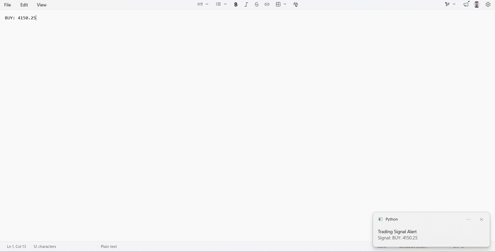

# Real-Time Trading Signal Detector

A Windows desktop application that captures a selected screen area, processes OCR via Tesseract and OpenCV to detect `BUY` / `SELL` trading signals, and sends desktop notifications without triggering redundant duplicate alerts.

## Tech Stack
- **Language:** Python 3.x
- **Screen Capture:** MSS
- **Image Processing & OCR:** OpenCV, Tesseract OCR (`pytesseract`)
- **Notifications:** Plyer
- **Regex:** Standard `re` module for price/signal matching

## Features
- Continuous real-time screen area capture
- Preprocessing (Grayscale, Thresholding, Whitelisting) to eliminate OCR noise
- Regex parsing for patterns like `BUY: 4150.25` or `SELL: 4148.60`
- Sequential stability counter to filter frame flickering
- Windows desktop alerts (`plyer.notification`)
- Duplicate notification suppression for unchanged prices

## Prerequisites
1. Download and install [Tesseract OCR](https://github.com/UB-Mannheim/tesseract/wiki) for Windows.
2. Default path expected: `C:\Program Files\Tesseract-OCR\tesseract.exe`

## Installation & Setup

1. Open PowerShell in the project directory:
   ```powershell
   python -m venv venv
   .\venv\Scripts\Activate.ps1

