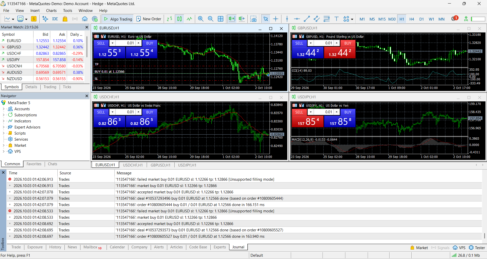
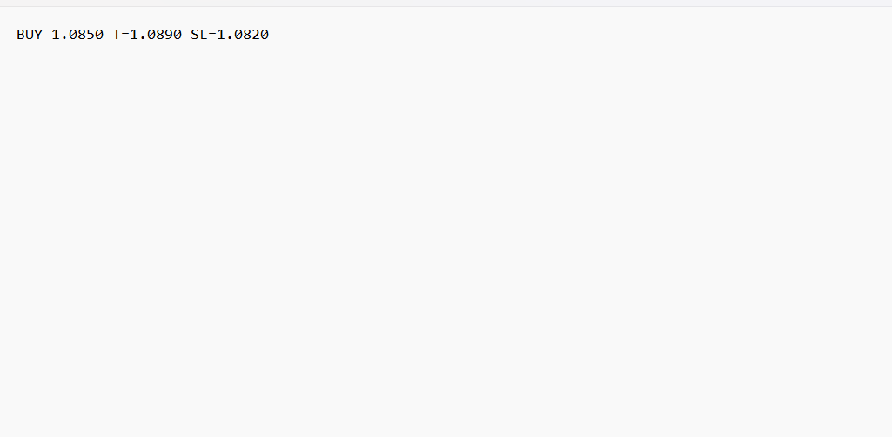

# Real-Time Trading Signal Detector & MT5 Auto-Executor

A Windows desktop application that captures a selected screen area, processes OCR via Tesseract and OpenCV to detect `BUY` / `SELL` trading signals, and automatically executes orders on MetaTrader 5 with dynamic SL/TP validation.

## Tech Stack
- **Language:** Python 3.x
- **Screen Capture:** MSS
- **Image Processing & OCR:** OpenCV, Tesseract OCR (`pytesseract`)
- **Trading Platform:** MetaTrader 5 (`MetaTrader5`)
- **Notifications:** Plyer
- **Regex:** Standard `re` module for price/signal matching

## Features
- Continuous real-time screen area capture
- Preprocessing (Grayscale, Thresholding, Whitelisting) to eliminate OCR noise
- Regex parsing for patterns like `BUY` / `SELL` entry, TP, and SL
- Sequential stability counter to filter frame flickering
- Automatic MT5 order placement with dynamic SL/TP boundary handling
- Dynamic broker filling mode fallback system (Code 10030 recovery)
- Windows desktop alerts (`plyer.notification`)
- Duplicate order suppression for unchanged signals

## Prerequisites
1. Download and install [Tesseract OCR](https://github.com/UB-Mannheim/tesseract/wiki) for Windows.
2. Default path expected: `C:\Program Files\Tesseract-OCR\tesseract.exe`
3. MetaTrader 5 Terminal installed and logged in.

## Installation & Setup

1. Open PowerShell in the project directory:
   ```powershell
   python -m venv venv
   .\venv\Scripts\Activate.ps1
   pip install -r requirements.txt



